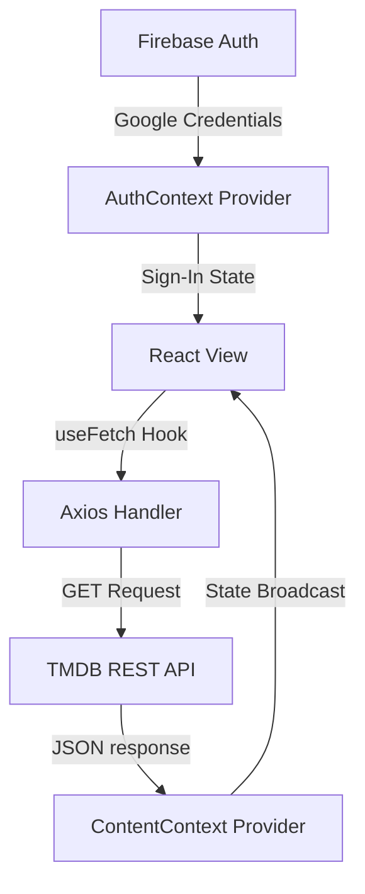

<div align="center">

# 🎬 CineVerse

### Premium Movies & Streaming Showcase Platform · React & Vite

[](https://cine-verse-parthag23.vercel.app/)
[](https://react.dev)
[](https://vite.dev)
[](https://tailwindcss.com)
[](https://framer.com/motion)

**CineVerse** is a modern, high-end movie database and preview catalog web application. Integrating live TMDB API streams, glassmorphic layout panels, robust search parameters, and a custom Auth Context, it delivers a smooth cinematic discovery interface.

*Framer Motion Transitions · TMDB Streaming API · Custom Context Hooks · Elegant Loader States*

</div>

---

## ✨ Key Features

| Feature | Description |
|---------|-------------|
| 🎠 **Banner Carousel** | Interactive, auto-advancing banner slider featuring trending movies and visual backdrops. |
| 🔍 **Live Query Filter** | Instant client-side filters using category pills (Action, Sci-Fi, Horror, etc.). |
| 💅 **Premium Skeleton Loaders** | Content shimmer templates ensuring a polished visual state while loading data. |
| 🛡️ **Firebase Integration** | Unified sign-in framework supporting credential logins and Google Single Sign-On. |
| 📱 **Adaptive Sidebar** | Floating glass navbar for desktops that collapses to a touch-optimized bottom bar on mobile. |

---

## 🧱 Tech Stack

| Layer | Technology |
|-------|-----------|
| ⚛️ **UI Framework** | React 18 |
| ⚡ **Build System** | Vite |
| 🎨 **Styling** | Tailwind CSS v4 |
| ✨ **Animations** | Framer Motion |
| 📡 **API Client** | Axios |
| 🧭 **Routing** | React Router v6 |

---

## ⚙️ Getting Started

### Prerequisites
* **Node.js** 18+

### Quick Start

```bash
# 1. Clone the repository
git clone https://github.com/ParthaG23/CineVerse.git
cd CineVerse/Client

# 2. Add Environment Variables
# Create a .env file with your TMDB and Firebase settings
# VITE_API_URL=your_api_url

# 3. Install packages
npm install

# 4. Start local server
npm run dev
```
App runs at → **http://localhost:5173**

---

## 🏗️ Architecture



---

## 🧑‍💻 Author

**Partha Gayen**

[](https://github.com/ParthaG23)
[](https://www.linkedin.com/in/partha-gayen)

---

## 📜 License

This project is licensed under the **MIT License**.
